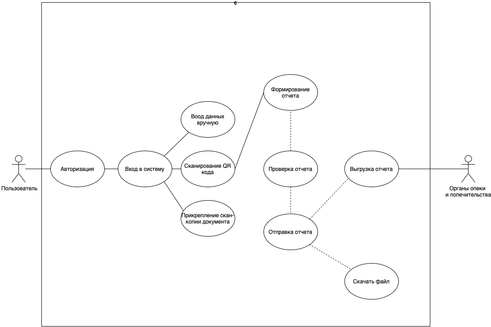

# 4.ОПИСАНИЕ ПРОДУКТА
## 4.1. Предлагаемое решение

Предлагаемый нами продукт исполняет три основных функции: 
- сбор и хранение данных о платежнвх операциях,
- калькуляция всез платежных операций, 
- сведение отчета об операциях при запросе. 

Таким образом, приложение содержит 3 основных модуля: 

1-модуль для сканирования qr-кодов, для фото обеспечивающий выявление атрибута "цена", "дата", а также, обеспечивающий хранение этих атрибутов в бд; 

2- модуль-калькулятор, обеспечивающи подсчет всех атрибутов "цена", в том числе, распознанных ИИ или вручную; 

3- модуль формирования отчета, обеспечивающий формирование отчетной документации непосредственно по запросу пользователя и передающий ее вышестоящему проверяющему лицу

<h3 align="center"> Рисунок 6. Диаграммa
вариантов использования </h3>

## 4.2. Предположения и зависимости

- Пользователи обладают мобильным устройством на платформе Andriod, IOS, web.
- Пользователи обладают возможностью создавать и сохранять отчет.
- Пользователи обладают возможностью отправлять отчет инспектору опеки.
- Документы поступающие на ввод хоршо читаемые и не содержат ошибок.
- У пользователя (отправителя отчетности) есть учетная запись на портале Госуслуги

## 4.3. Затраты, каналы продвижения
[Для некоторых продуктов вопросы стоимости и ценообразования могут напрямую влиять
на определение и реализацию приложения. В этом разделе запишите все соответствующие
ограничения по стоимости и ценообразованию, предполагаемой прибыли.
Также кратко опишите возможные каналы и стратегии продвижения продукта (по
желанию).]

## 4.4. Функциональные возможности

Таблица 5 – Функциональные требования к продукту
 </color blue>

|**ID функционального требования**| **Требование**|**Связанные требования**|**Комментарии**|**Приоритет**|
|:------: | :-----: | :-----: | :----: | :----:|
| Модуль 1/ Запрос создания отчета|
|1 | Обработка и хранение информации о клиенте| Наличие серверов, для хранения данных пользователей  | Выделение оборудования для хранения информации | Безопастность данных | 
|2 | Проверка запроса БД на корректность| Создание проверочных запросов по БД, для выявление неиспровностей или утечки информации | Выделение мощьностей для быстроты реализации запросов | Безопастность, быстродействие | 
|3 | Генерация заявки на внесение в БД| Создание заявки, для допуска к выполнению следующему пунтку | Выделение оборудования для хранения информации. Проверка всех данных, для генирации заявки| Безопастность |
|4 | Наличие хранилища информации под данные пользователя | Создание резервного хранилища, для предотвращении потери данных | Выделение оборудования для хранения информации | Безопастность |
|5 | Наличие инструментов для проверки личности пользователя| Связь с разными источниками личных данных, для предотвращение незаконных действий | Сопоставление с общей БД | Безопастность |
|Модуль 2/ Анализ полученных данных|
|2 |хз| хз | хз | Пхз |
|Модуль 3/ Отправка отчёта|
|3 |хз| хз | хз | хз |

<iframe src="https://disk.yandex.ru/i/EJigetb0qdU9Kw" width="700" height="400"></iframe>

